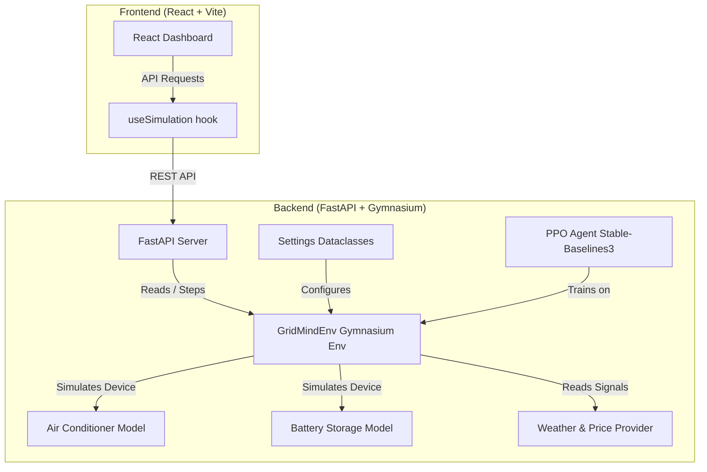

# GridMind 🧠🔋

GridMind is a reinforcement learning (RL) powered smart energy management simulator. It models a single-building, single-day environment where an intelligent agent learns to control HVAC (heating, ventilation, and air conditioning) and home battery storage systems. The goal is to minimize electricity costs while maintaining occupant thermal comfort across a 24-hour simulation under dynamic weather conditions and time-of-use pricing tariffs.

---

## website link : https://grid-mind-e9bpvr40m-lielstephen-gmailcoms-projects.vercel.app

## 🚀 Key Features

*   **Custom Gymnasium Environment**: Implements a standard `gym.Env` modeling building thermal thermodynamics, battery state-of-charge (SOC), solar PV arrays, and occupant schedules.
*   **Deep RL Integration**: Leverages Stable-Baselines3's state-of-the-art **PPO (Proximal Policy Optimization)** algorithm.
*   **Interactive React Dashboard**: A sleek, real-time UI built with React, Vite, and Recharts to visualize temperature curves, power draws, battery storage, and agent telemetry.
*   **Production Ready**: Fully tested using `pytest` and packaged with Docker and Docker-compose configurations for rapid cloud deployment.

---

## 🛠️ Architecture Overview

For a detailed review of the system design, check the [architecture.md](file:///e:/rl project/GridMind/architecture.md) documentation.



```
GridMind/
├── backend/
│   ├── api/            # FastAPI server — REST endpoints for the dashboard
│   ├── config/         # Centralized configuration (dataclasses for physical/hyperparameters)
│   ├── rl/             # Gymnasium environment (GridMind/Energy-v0)
│   ├── simulator/      # Physical models — HVAC, Battery, Weather, Pricing
│   ├── training/       # PPO training loop (Stable-Baselines3)
│   ├── models/         # Saved model checkpoints (.zip)
│   └── utils/          # Shared helpers — observation parsing, unit formatters
│
├── frontend/           # React + Vite dashboard with Recharts visualization
│
├── tests/              # pytest suite — environment dynamics, API, helper tests
├── docker/             # Containerization configurations (Dockerfiles)
├── requirements.txt    # Python dependency definitions
├── docker-compose.yml  # Multi-container local orchestration configuration
└── start.ps1           # Windows one-click local launcher
```

---

## 🤖 Reinforcement Learning Methodology

GridMind frames smart energy management as a **Markov Decision Process (MDP)** solved using model-free Deep Reinforcement Learning.

### 1. State Space (7-dim Continuous)
The agent receives a continuous observation vector at each 15-minute timestep containing:
1.  **Hour of Day** (0–23): Informs the agent of current time and future pricing/occupancy.
2.  **Indoor Temperature**: Measured room temperature in °C.
3.  **Outdoor Temperature**: Dynamic outdoor ambient temperature.
4.  **Solar Generation (per-unit)**: Normalized PV generation curve.
5.  **Battery State of Charge (SOC)**: Current charge level of the battery ($0.0 \text{ to } 1.0$).
6.  **Grid Price**: Time-of-use electricity pricing ($\$/kWh$).
7.  **Occupancy Flag**: Boolean value indicating if building occupants are currently present.

### 2. Action Space (Discrete 5)
The agent outputs one of 5 operational control choices:
*   `0` — **Idle**: Maintain current state (no AC changes, no battery activity).
*   `1` — **Turn AC On**: Actively cool the room (draws rated HVAC power).
*   `2` — **Turn AC Off**: Stop active cooling.
*   `3` — **Charge Battery**: Charge the battery from the utility grid.
*   `4` — **Discharge Battery**: Use stored battery power to support the building load.

### 3. Multi-Objective Reward Function
The reward signal shapes a balance between operating budget and occupant satisfaction:
$$\text{Reward} = -(\text{Grid Cost} + \text{Comfort Penalty})$$
*   **Grid Cost**: Energy consumption ($kW$) multiplied by the active price tariff ($\$/kWh$).
*   **Comfort Penalty**: A thermal discomfort penalty applied *only* during occupied hours when the temperature drifts outside the $20\text{–}24^\circ\text{C}$ comfort band.

### 4. Why PPO is the Best RL Choice for this Task
GridMind uses **Proximal Policy Optimization (PPO)**, which is highly suited for this project for several key reasons:
*   **Sample Efficiency and Training Stability**: Standard Policy Gradient methods often suffer from high variance and destructive step updates. PPO's clipped objective function restricts policy updates to a safe range, ensuring stable convergence.
*   **Handling Trade-Offs Without Rules**: Instead of building complex heuristics or hard-coded lookup tables, PPO easily optimizes the non-linear trade-offs between thermal dynamics (AC activation) and battery state transitions relative to pricing spikes.
*   **Generalization to Stochastic Signals**: PPO generalizes robustly to continuous outdoor weather fluctuations and shifting peak/off-peak price charts, adapting its control policy dynamically across diverse seasonal regimes.

---

## ⚡ Quick Start

### Prerequisites
*   Python 3.10+
*   Node.js 18+

### 1. Setup Environment
```bash
# Clone the repository
git clone https://github.com/LielStephen/GridMind.git
cd GridMind

# Setup Backend Virtual Environment
python -m venv backend/venv
.\backend\venv\Scripts\activate
pip install -r requirements.txt

# Setup Frontend
cd frontend
npm install
cd ..
```

### 2. Run the Application
You can run the application using the **one-click PowerShell launcher**:
```powershell
.\start.ps1
```

Or run them manually in separate terminals:
```bash
# Terminal 1 — Backend FastAPI Server
.\backend\venv\Scripts\python.exe -m uvicorn backend.api.main:app --reload --port 8000

# Terminal 2 — Frontend Development Server
cd frontend && npm run dev
```

*   **Dashboard**: [http://localhost:5173](http://localhost:5173)
*   **Swagger API Docs**: [http://localhost:8000/docs](http://localhost:8000/docs)

---

## 🏋️ Agent Training

To train the PPO agent or log metrics to TensorBoard:
```bash
# Activate your venv and run:
python -m backend.training.train --timesteps 50000 --envs 4
```
Tensorboard logs are automatically stored in `./ppo_gridmind_tensorboard/`. You can visualize performance by running `tensorboard --logdir=./ppo_gridmind_tensorboard/`.

---

## 🧪 Testing

Run the complete test suite (validating the environment, simulator devices, helpers, and REST APIs):
```bash
python -m pytest tests/ -v
```

---

## 🚢 Deployment

The project is packaged for both local Docker setups and cloud platforms:
*   **Docker Compose**: Use `docker-compose up --build` to launch the API and Nginx-served frontend together in isolated containers.
*   **Cloud Hosting**: Deploy the backend service to **Render** / **Railway** and host the compiled frontend build on **Vercel** / **Netlify** (refer to the [architecture.md](file:///e:/rl%20project/GridMind/architecture.md) guide for environment configuration).
